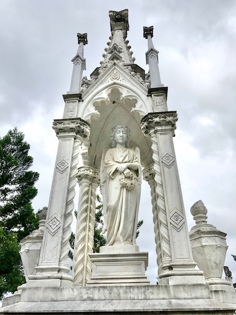

## Patrick Mayne <small>(7‑49‑9)</small> 

The large white monument to this family and the story of how Mayne gained his wealth is the subject of a book by Rosamond Siemon, *The Mayne Inheritance*. Mayne was born in 1825 at Cookstown, Tyrone, the son of Isaac Mayne and Rose Mullin. He arrived in Brisbane in 1849 after marrying in Sydney, Mary McIntosh from Ennis, Co. Clare. 

Mayne gained his wealth by the reputed murder of a cedar cutter and established his butcher business in Queen St where the present Brisbane Arcade stands. He was an Alderman of the Brisbane City Council 1853 to 1865, the year he died of a heart attack. His rumoured death‑bed confession extracted a promise from his children that they would not continue the family line. The family’s finances eventually benefited many public institutions especially The University of Queensland.

{ width="40%" }  
